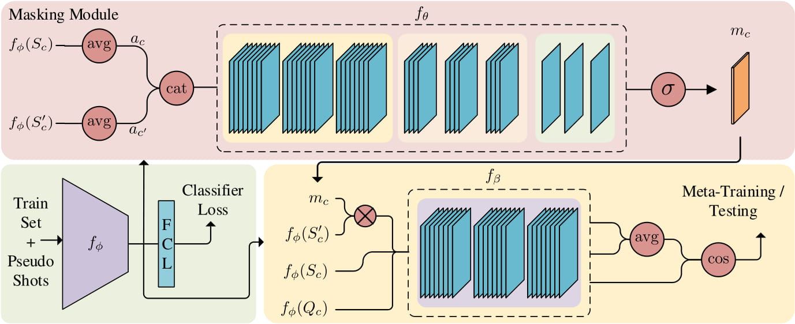

# Pseudo Shots: Few-Shot Learning with Auxiliary Data
Code for [Pseudo Shots: Few-Shot Learning with Auxiliary Data](https://arxiv.org/abs/2012.07176).



## Requirements
* python 3.8.6
* pytorch 1.5.1
* torchvision
* tensorboardX

The code is tested on ubuntu 18.04.

## Setup
Run the follwowing in the project root to create the required directory structure.
```
mkdir ../data_root
mkdir ../data_root/mini-imagenet
mkdir ../data_root/tiered-imagenet
mkdir ../data_root/cifarfs
mkdir ../data_root/fc100
```
Download and extract the compressed file for each dataset to the corresponding directory.

[mini-ImageNet](https://drive.google.com/file/d/1XgQPWe58wAcbddljo0897Djz8lF9uB3i/view?usp=sharing) \
[tiered-ImageNet](https://drive.google.com/file/d/1uw3jQY0uEBJbHdXQlXxOGNro8S5wn51P/view?usp=sharing) \
[cifarfs](https://drive.google.com/file/d/18S7rELWR2cPw5If2ZsxmqtaQlfKNLj5H/view?usp=sharing) \
[fc100](https://drive.google.com/file/d/1W3SmOlYpUARwpBphF_PLMXIyQ10IN39R/view?usp=sharing)

Download and extract the compressed meta-data file to `../data_root` directory.

[meta-data](https://drive.google.com/file/d/1NVghOJppjKZ76g2zp0lsX6JGAyzJQU86/view?usp=sharing)

## Evaluation

To evaluate a model run the following command.

```
python test_few_shot.py --dir DIR --nshot NSHOT
```

* `DIR` is the directory where the model is saved.
* You should specificy `NSHOT` when evaluating the basic model.

You can download our pre-trained variables for the masking model here:

[Pre-trained Variables](https://drive.google.com/drive/folders/1F1PZQUG9oTFNijCOdvyiMkosqtDp-mzQ?usp=sharing)

## Training

**Feature Embedding.** To train the feature embedding parameters from scratch run the following command.

```
python train_classifier.py --config CONFIG
                           --aux-level AUX-LEVEL
                           [--topk {TOPK}]
                           [--name {NAME}]
                           [--tag {TAG}]
```

* `CONFIG` is the path to the desired YAML config file.
* `AUX-LEVEL` is the level of semantic pruning for auxiliary data.
* `TOPK`(int) specifies the K most similar classes to use for auxiliary data.
* `NAME` overrides the default model name.
* `TAG` is an optional name tag.

**Masking Model.** To train the masking model parameters run the follwoing command.

```
python train_fsl.py --config CONFIG
                    --embedding EMBEDDING
                    --aux-level AUX-LEVEL
                    --nshot NSHOT
                    --helper
                    [--topk {TOPK}]
                    [--name {NAME}]
                    [--tag {TAG}]
```

* `CONFIG` is the path to the desired YAML config file.
* `EMBEDDING` is the path to where you saved the embedding model parameters.
* `AUX-LEVEL` is the level of semantic pruning for auxiliary data.
* `NSHOT` is the number of shots in a K-shot N-way episode.
* `helper` determines whether to use the helper dataset or not.
* `TOPK`(int) specifies the K most similar classes to use as auxiliary data.
* `NAME` overrides the default model name.
* `TAG` is an optional name tag.


## Citation
If you use this repo, please cite the corresponding paper.

*Esfandiarpoor, R., Hajabdollahi, M. and Bach, S.H., 2020. Pseudo Shots: Few-Shot Learning with Auxiliary Data. arXiv preprint arXiv:2012.07176.*

```
@article{esfandiarpoor:arxiv20,
  Author = {Esfandiarpoor, R. and Hajabdollahi, M. and Bach, S. H.},
  Title = {Pseudo Shots: {F}ew-Shot Learning with Auxiliary Data},
  Volume = {arXiv:2012.07176 [cs.LG]},
  Year = {2020}}
```

## Acknowledgement
The code in this repo is based on the following repositories:
* [A New Meta-Baseline for Few-Shot Learning](https://github.com/yinboc/few-shot-meta-baseline)
* [Rethinking few-shot image classification: a good embedding is all you need?](https://github.com/WangYueFt/rfs/)

